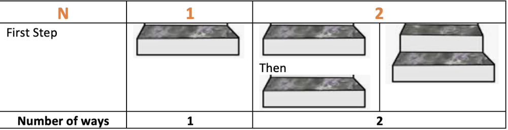
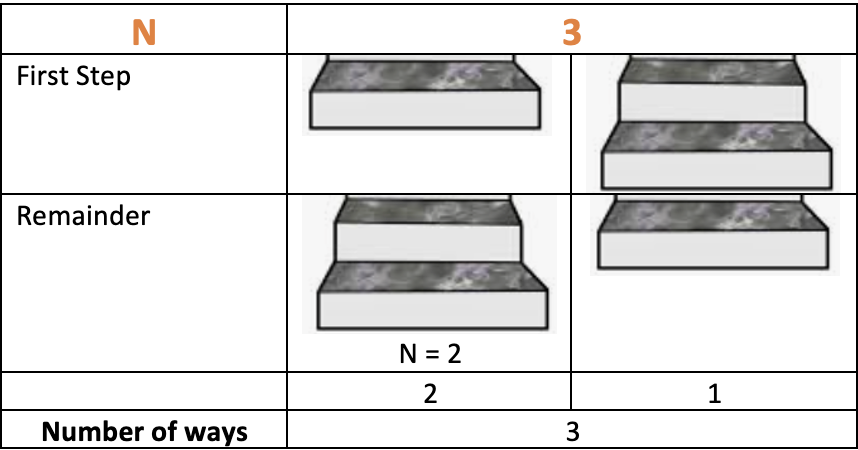
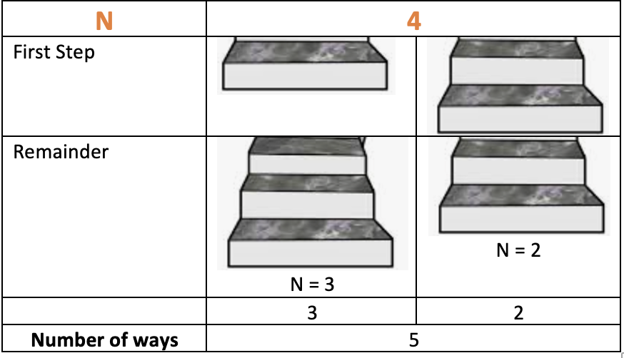
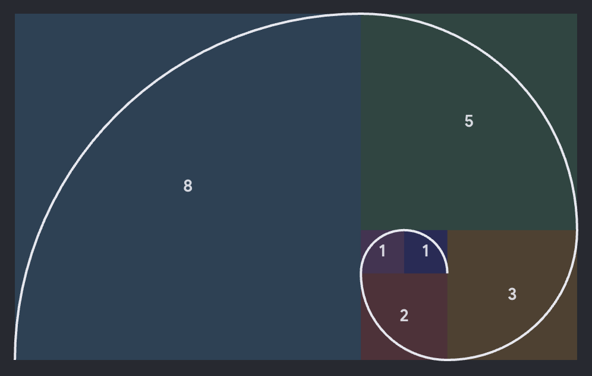
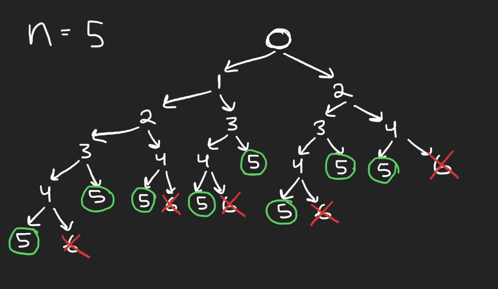
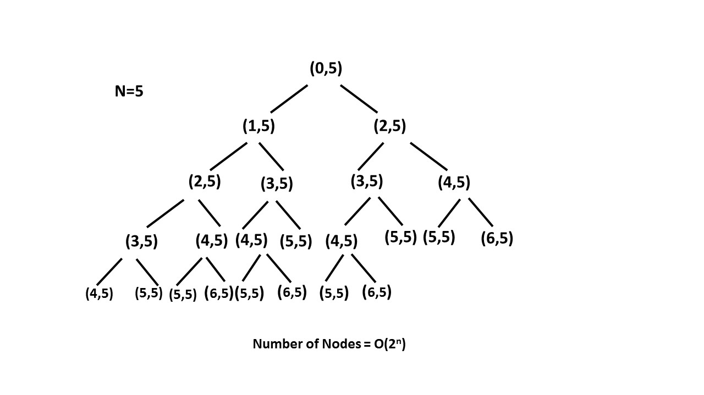
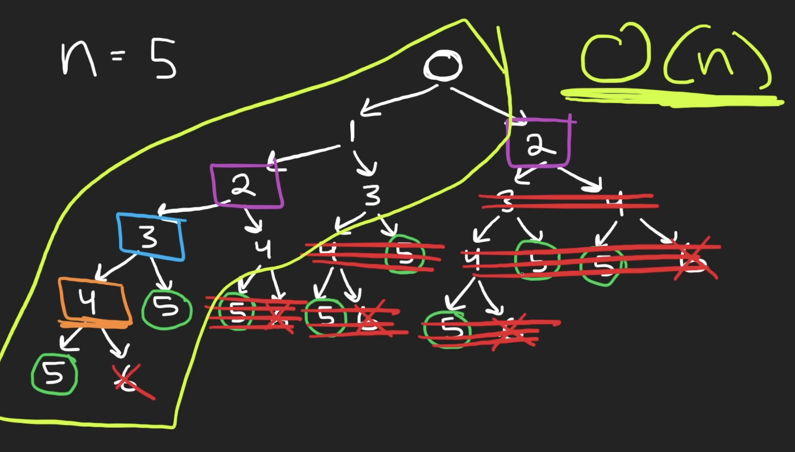
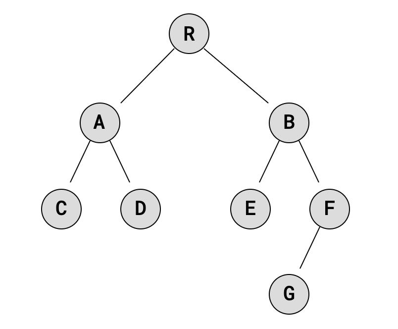

# Climbing Stairs

<span class="pill easy">Easy</span> <span class="pill">Worked through</span> <span class="pill">Dynamic programming</span> <span class="pill">Fibonacci</span>

[Open on LeetCode :material-open-in-new:](https://leetcode.com/problems/climbing-stairs/){ .md-button }

---

## The question

It takes `n` steps to reach the top of a staircase. Each move climbs either **1** or **2** steps. How many distinct ways are there to reach the top?

=== "Example 1"

    ```text
    Input:  n = 2
    Output: 2

    1 step + 1 step
    2 steps
    ```

=== "Example 2"

    ```text
    Input:  n = 3
    Output: 3

    1 + 1 + 1
    1 + 2
    2 + 1
    ```

---

<div class="step-row">
  <div class="step-chip s1">1 · Plan<small>arithmetic, then a rethink</small></div>
  <div class="step-chip s2">2 · Build the pattern<small>small cases upward</small></div>
  <div class="step-chip s3">3 · Draw the tree<small>see the repetition</small></div>
  <div class="step-chip s4">4 · The code<small>three versions</small></div>
</div>

## 1 · Plan

!!! plan "First reading"

    A number arrives, and the answer is how many distinct ways `1` and `2` fit into it.

    ```text
    n = 3
      1 + 1 + 1
      2 + 1
      1 + 2
    -> 3
    ```

    The first instinct was arithmetic: floor division, `n // 2`, counting how many twos fit and adjusting. That does not go anywhere, because the answer depends on the **order** the steps are taken in, not just how many of each there are. `2 + 1` and `1 + 2` are the same multiset and two different answers.

    This is the same shape as the lesson from [Valid Parentheses](valid-parentheses.md): a question about **order** cannot be answered by counting.

!!! plan "The hint that reframes it"

    > To reach the nth step, what could the previous step have been?

    Only two things can happen on the **first** move: climb 1, or climb 2. Whatever happens after that is the same question again on a smaller staircase. That turns one hard question into two easier ones, which is the definition of a recursive problem.

## 2 · Building the pattern from the bottom

**n = 1 and n = 2**

<figure markdown>
  { .diagram }
  <figcaption>One stair has one route. Two stairs have two: 1 then 1, or a single 2.</figcaption>
</figure>

**n = 3**

<figure markdown>
  { .diagram }
  <figcaption>First step of 1 leaves 2 stairs, which is 2 ways. First step of 2 leaves 1 stair, which is 1 way. Total 3.</figcaption>
</figure>

**n = 4**

<figure markdown>
  { .diagram }
  <figcaption>First step of 1 leaves 3 stairs, which is 3 ways. First step of 2 leaves 2 stairs, which is 2 ways. Total 5.</figcaption>
</figure>

!!! insight "The one idea to remember"

    The number of ways to climb `x` stairs is the ways to climb `x - 1` plus the ways to climb `x - 2`.

    ```text
    ways(n) = ways(n - 1) + ways(n - 2)
    ```

    Because the first move is either a 1 (leaving `n - 1`) or a 2 (leaving `n - 2`), and those two groups of routes never overlap.

    That recurrence is the **Fibonacci sequence**: each number is the sum of the two before it.

<figure markdown>
  { .screenshot }
  <figcaption>1, 1, 2, 3, 5, 8, 13, 21. The staircase answers are this sequence shifted along by one.</figcaption>
</figure>

| n | 1 | 2 | 3 | 4 | 5 | 6 | 7 | 8 |
|---|---|---|---|---|---|---|---|---|
| ways | 1 | 2 | 3 | 5 | 8 | 13 | 21 | 34 |

## 3 · Drawing the tree

The recurrence is easy to state and hard to picture, so the next step was to draw every route as a tree. Each node is "how many stairs climbed so far", each left branch adds 1, each right branch adds 2. A branch that lands exactly on `n` is a valid route. A branch that overshoots is a dead end.

<figure markdown>
  { .screenshot }
  <figcaption>n = 5. Green circles land exactly on 5 and count. Red crosses overshoot to 6 and do not. Eight green circles, and the answer is 8.</figcaption>
</figure>

!!! insight "Why draw it at all"

    A tree is a way of organising an exhaustive set of combinations so they can be **seen**. Memorising that the answer is Fibonacci does not teach how to get there. Drawing the branches does, and the same picture works for any numeric problem where each step has a small fixed set of choices.

    It also makes the cost visible, which the recurrence alone does not.

<figure markdown>
  { .diagram }
  <figcaption>Every node spawns two children, so the naive recursion is exponential.</figcaption>
</figure>

!!! plan "Spotting the repetition"

    The same sub-problem appears in many different places in that tree. Climbing to 3 gets solved again and again, once for every route that happens to pass through 3.

<figure markdown>
  { .screenshot }
  <figcaption>Crossing out every repeat leaves one small spine of unique sub-problems. Exponential collapses to linear.</figcaption>
</figure>

!!! insight "Memoisation"

    **Memoisation** stores the result of a call so that the same input never gets computed twice. The second time `ways(3)` is asked for, the answer is already in the cache.

    There are only `n` distinct sub-problems, `ways(1)` up to `ways(n)`. Solving each one once takes it from `O(2ⁿ)` to `O(n)`. That is the whole of dynamic programming in one move: **find the repeated sub-problems and stop repeating them**.

## 4 · Trees as a data structure

A **tree** is nodes holding data, each linked to further nodes, so the structure branches instead of running in a line. A **binary tree** limits each node to at most two children, left and right, which is exactly the shape of this problem: climb 1, or climb 2.

<figure markdown>
  { .diagram }
  <figcaption>Each node holds data and up to two children.</figcaption>
</figure>

Trees are used for hierarchical data such as file systems, for fast lookup in databases, for routing tables, for sorting and searching, and for priority queues via binary heaps.

??? note "A single node in Python"

    ```python
    class TreeNode:
        def __init__(self, data):
            self.data = data
            self.left = None
            self.right = None

    root = TreeNode('R')
    root.left = TreeNode('A')
    root.right = TreeNode('B')

    print(root.right.data)   # B
    ```

!!! optimise "Building the staircase tree from scratch"

    Written after an OOP course rather than copied. The class takes a target `num` and two increments, then builds the whole decision tree breadth first with a queue.

    ```python
    class Node:
        def __init__(self, data=0):
            self.data = data
            self.left = None
            self.right = None


    class BinaryTree:
        def __init__(self, num=3, leftInc=1, rightInc=2):
            self.root = Node(0)
            self.num = num
            self.leftInc = leftInc
            self.rightInc = rightInc

        def populate_node(self, node):
            if node.left is None:
                node.left = Node(node.data + self.leftInc)
            if node.right is None:
                node.right = Node(node.data + self.rightInc)

        def build_tree(self):
            queue = [self.root]                     # initialised locally, not in __init__
            while len(queue) != 0:
                node = queue.pop(0)
                self.populate_node(node)
                if node.left.data < self.num:
                    queue.append(node.left)
                if node.right.data < self.num:
                    queue.append(node.right)

        def pretty_print(self):
            def _p(n, p="", l=True, r=True):
                if not n: return
                _p(n.right, p + ("│   " if l else "    "), False, False)
                print(p + (str(n.data) if r else ("└── " if l else "┌── ") + str(n.data)))
                _p(n.left, p + ("    " if l else "│   "), True, False)
            _p(self.root)


    tree = BinaryTree(5, 1, 2)
    tree.build_tree()
    tree.pretty_print()
    ```

    Output for `n = 5`, which is the hand drawn tree above, printed:

    ```text
    │           ┌── 6
    │       ┌── 4
    │       │   └── 5
    │   ┌── 2
    │   │   │   ┌── 5
    │   │   └── 3
    │   │       │   ┌── 6
    │   │       └── 4
    │   │           └── 5
    0
        │       ┌── 5
        │   ┌── 3
        │   │   │   ┌── 6
        │   │   └── 4
        │   │       └── 5
        └── 1
            │       ┌── 6
            │   ┌── 4
            │   │   └── 5
            └── 2
                │   ┌── 5
                └── 3
                    │   ┌── 6
                    └── 4
                        └── 5
    ```

!!! insight "This tree is already a working solver"

    Counting the leaves that land **exactly** on `n` gives the answer to the problem:

    | n | leaves landing on n | nodes built |
    |---|---|---|
    | 1 | 1 | 3 |
    | 2 | 2 | 5 |
    | 3 | 3 | 9 |
    | 4 | 5 | 15 |
    | 5 | 8 | 25 |
    | 6 | 13 | 41 |
    | 7 | 21 | 67 |
    | 8 | 34 | 109 |
    | 9 | 55 | 177 |
    | 10 | 89 | 287 |

    Both rows are Fibonacci. The answers are, and so is the tree's own size, growing by roughly 1.618 each time. The structure built to **look** at the problem turns out to have the answer sitting in its leaves.

    It is exponential, so it is not the solution to submit, but it is the reason the recurrence makes sense rather than being a fact to memorise.

## 5 · The three solutions

!!! attempt "Where the first drafts got to"

    ```python
    combinations = 0
    if n / 1 == n:
        combinations =+ 1
    elif n // 2 + 2 == n:
        combinations =+ 1
    return combinations
    ```

    The arithmetic idea does not model the problem, for the ordering reason in section 1.

    There is also a Python detail hiding in it. **`=+ 1` is not `+= 1`.** It parses as `= +1`, so it **assigns** the value 1 rather than adding to what is there. Running it three times still leaves `1`, not `3`. It never raises an error, which is what makes it worth knowing.

!!! optimise "Recursive, straight from the recurrence"

    ```python
    class Solution:
        def climbStairs(self, n: int) -> int:
            if n <= 2:
                return n
            return self.climbStairs(n - 1) + self.climbStairs(n - 2)
    ```

    Correct, and the direct translation of the tree. `O(2ⁿ)` time, so it times out well before `n = 45`.

!!! optimise "Memoised, top down"

    ```python
    class Solution:
        def climbStairs(self, n: int) -> int:
            cache = {1: 1, 2: 2}

            def ways(k):
                if k not in cache:
                    cache[k] = ways(k - 1) + ways(k - 2)
                return cache[k]

            return ways(n)
    ```

    Each of the `n` sub-problems is solved once. `O(n)` time, `O(n)` space for the cache and the call stack.

!!! optimise "Bottom up, two variables, `O(1)` space"

    ```python
    class Solution:
        def climbStairs(self, n: int) -> int:
            one, two = 1, 1

            for i in range(n - 1):
                temp = one
                one = one + two
                two = temp

            return one
    ```

    Start at the top and work backwards. From step `n` there is one way to be done. From `n - 1` there is one way. From there down, every step is the sum of the two below it, so only the last two values ever matter and the cache collapses to two variables.

    **Trace for n = 5**

    | pass | one | two |
    |---|---|---|
    | start | 1 | 1 |
    | 0 | 2 | 1 |
    | 1 | 3 | 2 |
    | 2 | 5 | 3 |
    | 3 | **8** | 5 |

    Returns 8, which matches the eight green circles in the hand drawn tree.

    In Python the `temp` shuffle can also be written as one line, `one, two = one + two, one`, which does the same thing without the temporary.

## 6 · Complexity

| Version | Time | Space | Notes |
|---|---|---|---|
| Build the whole tree | `O(2ⁿ)` | `O(2ⁿ)` | every route stored, good for seeing it |
| Plain recursion | `O(2ⁿ)` | `O(n)` | stack depth only |
| Memoised | `O(n)` | `O(n)` | cache plus stack |
| Two variables | `O(n)` | `O(1)` | nothing kept but the last two answers |

!!! insight "What dynamic programming actually is"

    Not a trick to memorise. Two questions:

    1. Does the problem break into smaller versions of itself? If yes, write the recurrence.
    2. Does the recursion tree solve the same sub-problem more than once? If yes, store the answers.

    Everything else is a choice about *where* to store them: a dict going top down, or a couple of variables going bottom up.

---

## Next time

* A question about **order** is not a counting question. Ordering means recursion or a structure, not arithmetic.
* When a recurrence is hard to picture, **draw the tree**. Nodes are states, branches are choices, and the repeated sub-trees become visible.
* Repeated sub-problems in that tree are the signal for **memoisation**, and that is the step that takes `O(2ⁿ)` to `O(n)`.
* Once only the last two results matter, the cache can shrink to two variables and the space goes to `O(1)`.
* `=+ 1` assigns, `+= 1` increments. No error either way.
* Reaching for the editorial on a problem with an unfamiliar structure underneath it is a reasonable call. The gap here was trees and dynamic programming, so closing that gap was the actual task.
