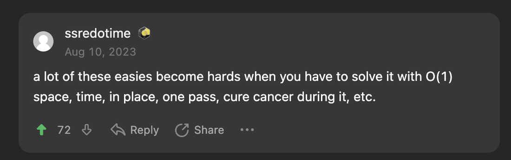
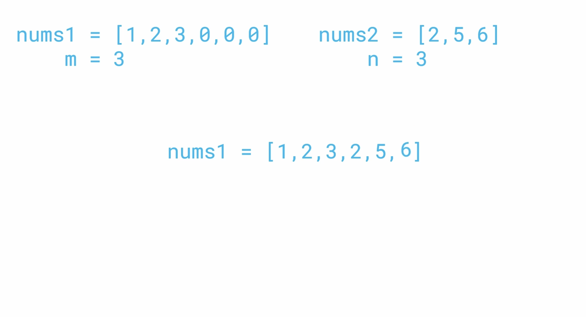
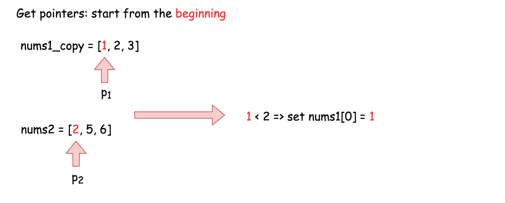
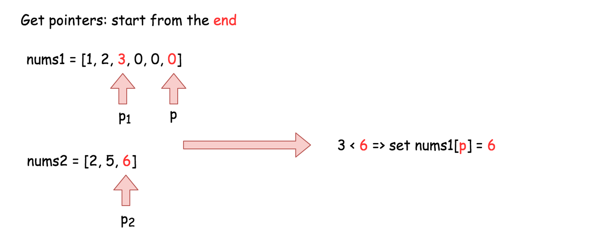

# Merge Sorted Array

<span class="pill easy">Easy</span> <span class="pill done">Solved</span> <span class="pill">Two pointers</span> <span class="pill">In place</span>

[Open on LeetCode :material-open-in-new:](https://leetcode.com/problems/merge-sorted-array/){ .md-button }

---

<figure markdown>
  { .screenshot }
  <figcaption>First, some wise words.</figcaption>
</figure>

## The question

Two integer arrays `nums1` and `nums2`, both already sorted ascending, plus two integers `m` and `n` giving the number of real elements in each.

`nums1` has length `m + n`. The first `m` slots hold its data and the last `n` slots are zeros, there to be filled. Merge the two into one sorted array, stored **inside `nums1`**. The function returns nothing.

=== "Example 1"

    ```text
    Input:  nums1 = [1,2,3,0,0,0], m = 3, nums2 = [2,5,6], n = 3
    Output: [1,2,2,3,5,6]

    The arrays merged are [1,2,3] and [2,5,6].
    ```

=== "Example 2"

    ```text
    Input:  nums1 = [1], m = 1, nums2 = [], n = 0
    Output: [1]

    Nothing to merge in, so nums1 is already the answer.
    ```

=== "Example 3"

    ```text
    Input:  nums1 = [0], m = 0, nums2 = [1], n = 1
    Output: [1]

    nums1 has no real elements. Its single 0 is a placeholder,
    not data. This is the case that catches the first attempt.
    ```

**Constraints**

* `nums1.length == m + n`
* `nums2.length == n`
* `0 <= m, n <= 200`
* `-10^9 <= nums1[i], nums2[j] <= 10^9`

**Follow up:** `O(m + n)` time.

<figure markdown>
  { .diagram }
  <figcaption>The setup. The three zeros are room, not values.</figcaption>
</figure>

---

<div class="step-row">
  <div class="step-chip s1">1 · Plan<small>say it in English</small></div>
  <div class="step-chip s2">2 · First attempt<small>fill the zeros, then sort</small></div>
  <div class="step-chip s3">3 · Use m and n<small>the given numbers</small></div>
  <div class="step-chip s4">4 · Optimise<small>pointers, then backwards</small></div>
</div>

## 1 · Plan

!!! plan "What is actually being asked"

    The result has to land **in `nums1` itself**. Returning a new list does not count, and neither does rebinding the name inside the function, because the caller only ever sees the original object.

    Both inputs arrive **already sorted**. That is the free information the whole problem turns on, and the brute force throws it away.

    Three facts worth writing down before touching code:

    * `len(nums1) == m + n`, so the space for the answer already exists.
    * The last `n` slots of `nums1` are padding.
    * `m` or `n` can be `0`, so an empty `nums2` and an all-placeholder `nums1` both have to work.

## 2 · First attempt

!!! attempt "Fill the zeros, then sort"

    ```python
    class Solution:
        def merge(self, nums1: List[int], m: int, nums2: List[int], n: int) -> None:
            i = 0
            for element in range(len(nums1)):
                if nums1[element] == 0:
                    nums1[element] = nums2[i]
                    i += 1
            nums1.sort()
    ```

    The shape is right: get everything into one array, then let `sort()` handle the ordering. The gap is in **how the padding gets found**.

    This version looks for the padding by value, testing `nums1[element] == 0`. That works on the sample input, where the only zeros happen to be padding. It stops working the moment a real `0` sits inside the first `m` elements, because a genuine value gets overwritten and the count of writes runs past the end of `nums2`.

    ```text
    nums1 = [0,2,3,0,0,0], m = 3, nums2 = [2,5,6], n = 3

    index 0 holds a real 0, so it gets overwritten too
    that is 4 writes into a nums2 of length 3
    -> IndexError: list index out of range

    expected [0,2,2,3,5,6]
    ```

    `0` is inside the constraint range `-10^9 <= nums1[i] <= 10^9`, so it is a legal value, not a marker.

## 3 · Use the numbers the question already gave

!!! insight "The one idea to remember"

    The padding does not need finding. Its position is **given**: it is exactly the slots from index `m` to index `m + n - 1`.

    Identify a region by **index**, never by a sentinel value, when the value could also be real data.

!!! optimise "One line changes"

    ```python hl_lines="4"
    class Solution:
        def merge(self, nums1: List[int], m: int, nums2: List[int], n: int) -> None:
            i = 0
            for element in range(m, m + n):
                nums1[element] = nums2[i]
                i += 1
            nums1.sort()
    ```

    `range(len(nums1))` walked every slot and used an `if` to guess which ones were padding. `range(m, m + n)` walks **only** the `n` padding slots, so no guessing is needed and the `if` disappears with it.

    The loop now runs exactly `n` times, which is exactly how many values `nums2` has, so `i` can never overshoot.

    This passes. Checked against every sorted pair drawn from `[-2,-1,0,1,2]` for all `m` and `n` up to 3, 3,135 cases, including every arrangement with real zeros in `nums1`.

!!! plan "The same idea, without the manual counter"

    `i` is being incremented by hand alongside `element`, and the two always move together. One index can drive both:

    ```python
    for i in range(n):
        nums1[i + m] = nums2[i]
    nums1.sort()
    ```

    `i` walks `nums2` from `0` to `n - 1`, and `i + m` is the matching slot in `nums1`. This is the editorial's first approach, and it is the same algorithm.

    **Complexity.** `O(n)` to copy plus `O((m + n) log(m + n))` to sort, so the sort dominates: **`O((m + n) log(m + n))` time**. Python's `sort()` is Timsort, which needs `O(m + n)` working space, so **`O(m + n)` space**.

    Good enough to pass, but it ignores the fact that both halves were already sorted. The follow up asks for `O(m + n)` time, and no comparison sort gets there.

## 4 · Optimise: two pointers

!!! insight "Sorting is doing work that is already done"

    Both arrays arrive sorted, so the smallest remaining value is always at the front of one of them. Comparing those two fronts is enough to build the answer in order, one element at a time, with no sorting at all.

    That is **`O(m + n)`**, because every element is looked at once.

### Pointers from the beginning

<figure markdown>
  { .diagram }
  <figcaption>p1 and p2 hold the front of each array. The smaller one wins the slot.</figcaption>
</figure>

!!! optimise "`O(m + n)` time, `O(m)` space"

    ```python
    class Solution:
        def merge(self, nums1: List[int], m: int, nums2: List[int], n: int) -> None:
            nums1_copy = nums1[:m]
            p1 = 0
            p2 = 0

            for p in range(m + n):
                if p2 >= n or (p1 < m and nums1_copy[p1] < nums2[p2]):
                    nums1[p] = nums1_copy[p1]
                    p1 += 1
                else:
                    nums1[p] = nums2[p2]
                    p2 += 1
    ```

    Writing forwards into `nums1` overwrites `nums1[0]` on the very first move, and that slot still holds data that has not been placed yet. The copy exists to protect it.

    So the sort is gone and the time is `O(m + n)`, but the copy costs `O(m)` **space**. One resource traded for another.

    !!! note "Two details in that condition"

        `p2 >= n or (p1 < m and ...)` is what stops a pointer running off the end once one array is exhausted. Python evaluates `or` and `and` left to right and stops early, so `nums2[p2]` is never reached when `p2 >= n`.

        Two structural things worth checking in a handwritten version: the loop body has to be **indented inside** `def merge`, and the `else` has to line up with its `if`. A stray indent here is a `NameError` or a silent wrong branch rather than an obvious failure.

### Pointers from the end

<figure markdown>
  { .diagram }
  <figcaption>Filling from the back writes into padding, so nothing has to be copied first.</figcaption>
</figure>

!!! optimise "Final, `O(m + n)` time, `O(1)` space"

    ```python
    class Solution:
        def merge(self, nums1: List[int], m: int, nums2: List[int], n: int) -> None:
            p1 = m - 1
            p2 = n - 1

            for p in range(n + m - 1, -1, -1):
                if p2 < 0:
                    break
                if p1 >= 0 and nums1[p1] > nums2[p2]:
                    nums1[p] = nums1[p1]
                    p1 -= 1
                else:
                    nums1[p] = nums2[p2]
                    p2 -= 1
    ```

    The copy was only ever needed because writing to the **front** of `nums1` destroyed unread data. Writing to the **back** does not, because the back is padding. Every slot `p` is filled before `p1` has any reason to reach it, so the array can be its own workspace.

    Comparing the two **largest** remaining values and placing the bigger one at the back builds the array right to left, still one comparison per element.

    `range(n + m - 1, -1, -1)` counts down: start at the last index, stop before `-1`, step `-1`.

    `if p2 < 0: break` handles `nums2` running out. Whatever is left in `nums1` is already sorted and already sitting in the right slots, so there is nothing to move.

!!! insight "The interview tip underneath this"

    > Whenever you're trying to solve an array problem in place, always consider the possibility of iterating backwards instead of forwards through the array.

    Forwards overwrites data that has not been read. Backwards writes into space that is free. Same algorithm, one resource cheaper.

## Complexity

| Version | Time | Space | Notes |
|---|---|---|---|
| Fill the zeros by value, then sort | `O((m+n) log(m+n))` | `O(m+n)` | breaks when `0` is real data |
| Fill slots `m` to `m+n`, then sort | `O((m+n) log(m+n))` | `O(m+n)` | correct, ignores that both are sorted |
| Two pointers from the beginning | `O(m+n)` | `O(m)` | needs a copy of the first `m` |
| Two pointers from the end | `O(m+n)` | `O(1)` | writes into the padding, no copy |

## Trace

**`nums1 = [1,2,3,0,0,0]`, `m = 3`, `nums2 = [2,5,6]`, `n = 3`**, filling from the end

| p | compare | placed | nums1 after | p1 | p2 |
|---|---|---|---|---|---|
| 5 | `3 > 6`? no | `nums2[2] = 6` | `[1,2,3,0,0,6]` | 2 | 1 |
| 4 | `3 > 5`? no | `nums2[1] = 5` | `[1,2,3,0,5,6]` | 2 | 0 |
| 3 | `3 > 2`? yes | `nums1[2] = 3` | `[1,2,3,3,5,6]` | 1 | 0 |
| 2 | `2 > 2`? no | `nums2[0] = 2` | `[1,2,2,3,5,6]` | 1 | -1 |
| 1 | `p2 < 0` | break | `[1,2,2,3,5,6]` | 1 | -1 |

Indices `0` and `1` are never written, and they do not need to be. `1` and `2` were already in place.

---

## Next time

* **Identify a region by index, not by value.** `m` and `n` were handed over precisely so the padding would not have to be guessed at. A given number beats a sentinel every time.
* Anything a question hands over unprompted is load bearing. `m`, `n` and "both arrays are sorted" were each doing work here.
* **In place means backwards is worth a look.** Writing forwards clobbers unread data. Writing into the free space at the end does not, and that is the difference between `O(m)` and `O(1)`.
* Calling `sort()` on data that arrived sorted is paying `log` for something already done. Two sorted inputs means merge, not sort.
* Spend longer on the drawing before the pseudocode. The zeros-are-real-data case shows up immediately on paper and not at all in the sample input.
