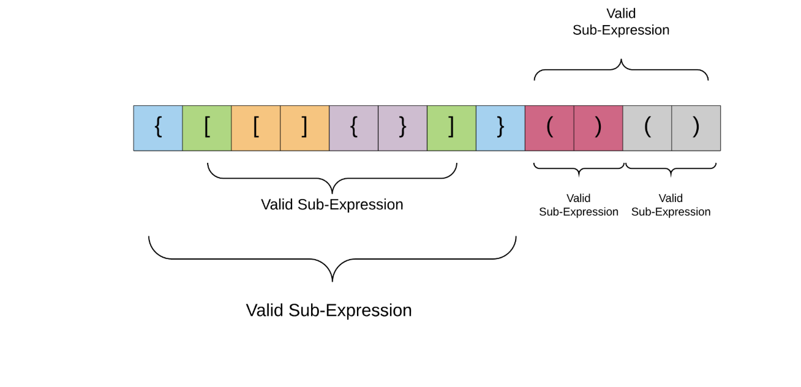
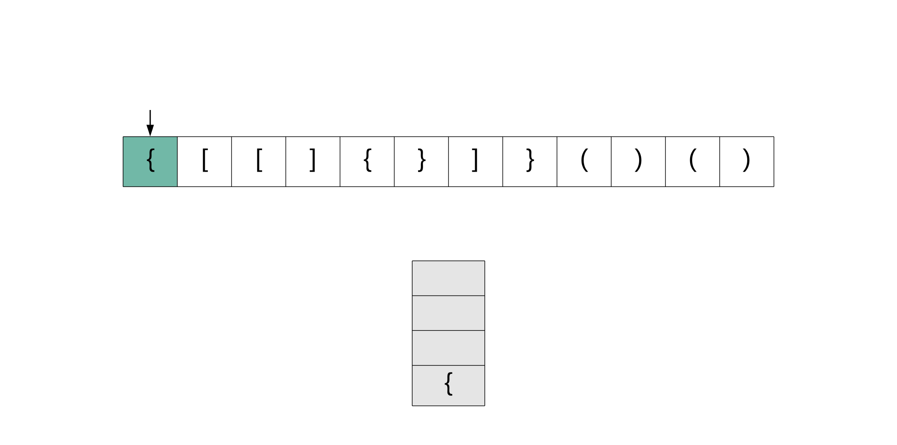
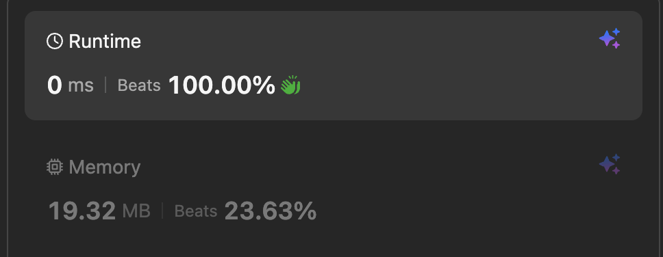

# Valid Parentheses

<span class="pill easy">Easy</span> <span class="pill done">Solved</span> <span class="pill">Stack</span> <span class="pill">Hash map</span>

[Open on LeetCode :material-open-in-new:](https://leetcode.com/problems/valid-parentheses/){ .md-button }

---

## The question

Given a string `s` containing just `(`, `)`, `{`, `}`, `[` and `]`, determine if the input string is valid.

A string is valid if:

* open brackets are closed by the **same type** of bracket
* open brackets are closed in the **correct order**
* every closing bracket has a corresponding opening bracket of the same type

=== "Valid"

    ```text
    "()"        -> true
    "()[]{}"    -> true
    "([])"      -> true
    ```

=== "Invalid"

    ```text
    "(]"        -> false   wrong type
    "([)]"      -> false   wrong order
    ```

---

<div class="step-row">
  <div class="step-chip s1">1 · Plan<small>learn the structure first</small></div>
  <div class="step-chip s2">2 · First idea<small>counting bracket types</small></div>
  <div class="step-chip s3">3 · Stack<small>the right shape</small></div>
  <div class="step-chip s4">4 · Hash map<small>tidy the branches</small></div>
</div>

## What a stack is

A **stack** is a linear data structure following **Last In, First Out** (LIFO). Like a stack of pancakes: things go on and come off the **top** only.

| Operation | Meaning | Python |
|---|---|---|
| **Push** | add an element to the top | `stack.append(x)` |
| **Pop** | remove and return the top element | `stack.pop()` |
| **Peek** | look at the top without removing it | `stack[-1]` |
| **isEmpty** | is there anything in it | `not stack` |
| **Size** | how many elements | `len(stack)` |

```python
stack = []

stack.append('A')      # push
stack.append('B')
stack.append('C')      # stack is now ['A', 'B', 'C']

top = stack[-1]        # peek  -> 'C', stack unchanged
popped = stack.pop()   # pop   -> 'C', stack is now ['A', 'B']
```

Stacks can be built from arrays or linked lists. The [Python docs](https://docs.python.org/3/tutorial/datastructures.html) point at a plain `list` for this: `append()` is push, `pop()` with no index is pop.

## 1 · Plan

!!! plan "What is actually being asked"

    Three bracket types, `()`, `[]`, `{}`. Input is a string `s` containing only those six characters.

    The rules are about **type** and **order**. Counting is not enough. `([)]` has one of every bracket and is still invalid, because the `(` closes while `[` is still open.

    So the structure is **nested**: a valid expression is made of valid sub-expressions inside valid sub-expressions.

<figure markdown>
  { .diagram }
  <figcaption>Every bracket pair encloses a complete, valid sub-expression. That nesting is what a stack tracks.</figcaption>
</figure>

!!! insight "The one idea to remember"

    The most recently opened bracket is the one that has to close **first**. That is Last In, First Out exactly, which is what a stack is.

    So: push every opening bracket. On a closing bracket, the top of the stack must be its partner. If it is, pop and carry on. If it is not, the string is invalid.

## 2 · First idea: counting types

!!! attempt "Checking that each type appears with its partner"

    ```python
    if "(" in s and ")" not in s:
        return False
    elif "[" in s and "]" not in s:
        return False
    elif "{" in s and "}" not in s:
        return False
    else:
        return True
    ```

    This gets `"([)]"` wrong. Both `(` and `)` are present, both `[` and `]` are present, so it returns `True`, even though the brackets close in the wrong order. `")("` slips through for the same reason.

    The rule it cannot see is **"open brackets must be closed in the correct order"**, and no amount of `in` checking will reach it, because `in` has no notion of position. That is the point where the problem needs a data structure rather than more conditions.

## 3 · Stack

!!! pseudo "Shape"

    ```text
    stack = []

    for each bracket in s
        if it is an opening bracket
            push it
        if it is a closing bracket
            if the stack is empty            -> invalid
            if the top is not its partner    -> invalid
            otherwise pop

    valid only if the stack is empty at the end
    ```

<figure markdown>
  { .diagram }
  <figcaption>Reading left to right. The first curly brace is an opening bracket, so it gets pushed and dealt with later.</figcaption>
</figure>

!!! plan "Why the `elif` needed rethinking"

    ```python
    for bracket in s:
        if bracket in ["{", "[", "("]:
            stack.append(bracket)
        elif stack[-1] in ["}", "]", ")"]:   # can never be true
            stack.pop()
    ```

    Only **opening** brackets are ever pushed, so `stack[-1]` can never be a closing bracket. That branch never runs.

    The fix is to test the character coming out of the string, not the one on the stack: when `bracket` is a closing bracket, check whether the top of the stack is its **complement**.

    Also `stack[-1]` on an empty stack raises `IndexError`, so the empty check has to come first.

!!! optimise "Working version, `O(n)` time, `O(n)` space"

    ```python
    class Solution:
        def isValid(self, s: str) -> bool:
            stack = []
            for bracket in s:
                if bracket in ["{", "[", "("]:
                    stack.append(bracket)
                elif bracket in ["}", "]", ")"]:
                    if stack == []:
                        return False
                    elif stack[-1] == "{" and bracket == "}":
                        stack.pop()
                    elif stack[-1] == "(" and bracket == ")":
                        stack.pop()
                    elif stack[-1] == "[" and bracket == "]":
                        stack.pop()
                    else:
                        return False

            if stack == []:
                return True
            else:
                return False
    ```

    Correct on all 2,015,539 bracket strings up to length 8.

<figure markdown>
  { .screenshot }
  <figcaption>0 ms, beats 100% on runtime.</figcaption>
</figure>

## 4 · Hash map

!!! insight "Three near-identical branches means the data belongs in a table"

    The three `elif` branches all say the same thing with different characters. That is a lookup table wearing an `if` statement.

    ```python
    pairs = {")": "(", "]": "[", "}": "{"}
    ```

    One line replaces all three, and adding a fourth bracket type later is one more entry rather than one more branch.

!!! optimise "With the pairs in a dict"

    ```python
    class Solution:
        def isValid(self, s: str) -> bool:
            stack = []
            for bracket in s:
                if bracket in ["{", "[", "("]:
                    stack.append(bracket)
                elif bracket in ["}", "]", ")"]:
                    if stack == []:
                        return False
                    pairs = {"}": "{", ")": "(", "]": "["}
                    if stack[-1] != pairs[bracket]:
                        return False
                    else:
                        stack.pop()

            if stack == []:
                return True
            else:
                return False
    ```

!!! plan "Three things to tighten"

    1. **`pairs` is built inside the loop**, so a fresh dict is created for every closing bracket. On a 10,000 character input that is 5,000 dictionaries when one would do. Same shape as the recomputed `min()` in [Longest Common Prefix](longest-common-prefix.md): a value that cannot change belongs above the loop.
    2. **`if bracket in ["}", "]", ")"]` duplicates the dict keys.** Once `pairs` exists, `if bracket in pairs` is the same test for free, and the two can never drift apart.
    3. **`if stack == []: return True else: return False`** is the `return cond` pattern from the [cheat sheet](../cheatsheet.md). It is `return not stack`.

!!! optimise "Final"

    ```python
    class Solution:
        def isValid(self, s: str) -> bool:
            pairs = {")": "(", "]": "[", "}": "{"}
            stack = []

            for bracket in s:
                if bracket in pairs:                 # a closing bracket
                    if not stack or stack.pop() != pairs[bracket]:
                        return False
                else:                                # an opening bracket
                    stack.append(bracket)

            return not stack                         # leftovers mean unclosed brackets
    ```

    `not stack or stack.pop() != pairs[bracket]` short circuits: if the stack is empty Python never evaluates the `pop()`, so there is no `IndexError`. The empty check and the match check collapse into one line.

    Also correct on all 2,015,539 strings, cross checked against the previous versions.

## 5 · Complexity

!!! optimise "`O(n)` time, `O(n)` space"

    **Time `O(n)`.** The string is processed one character at a time, and `append`, `pop` and a dict lookup are all `O(1)`. Work grows linearly with input length.

    **Space `O(n)`.** In the **worst case** every character is an opening bracket, such as `"(((((((((("`, so all `n` of them get pushed and nothing is ever popped. The stack ends up the same size as the input.

!!! insight "Complexity is always the worst case"

    That is the thing that clicked here. The question is never "what usually happens", it is **"what is the most this could possibly do"**.

    `"()()()()"` only ever holds one bracket on the stack, but `"(((("` holds all of them. The second one sets the space complexity. Looking for the input that makes the algorithm work hardest is the whole method.

---

## Next time

* **"Matching", "nested", "most recent", "undo"** all mean stack. LIFO is the giveaway.
* Presence checks (`in`) cannot see order. A rule about **sequence** needs a structure that remembers sequence.
* Repeated `elif` branches that differ only by a value are a lookup table waiting to happen.
* Build lookup tables **above** the loop, not inside it. Same lesson as [Longest Common Prefix](longest-common-prefix.md).
* `not stack or stack.pop() != ...` short circuits, which removes the separate empty check.
* For complexity, find the input that makes the algorithm work hardest, then describe that.
