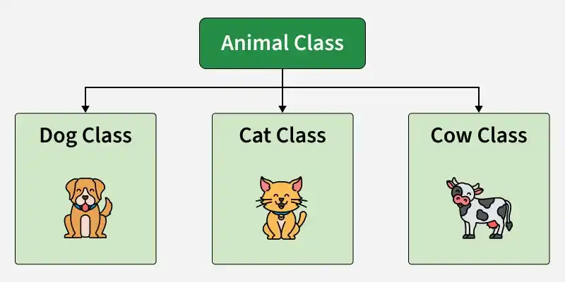

# OOP in Python

<span class="pill">Reference</span> <span class="pill">Python</span> <span class="pill">Classes</span>

Object oriented programming organises code around **data**, in the form of objects, rather than around functions and logic alone. The pitch is modular, maintainable and scalable applications: fewer lines than the equivalent procedural code, and one place to change when something changes.

This page exists because the [Climbing Stairs](easy/climbing-stairs.md) write up leans on a hand built `BinaryTree` class, and it made sense to have the vocabulary written down in one place.

---

## Class

A class is a **blueprint**. It describes what something is, not any particular one of them.

Anything that can be stated as a well defined idea can be a class. Two halves to it:

* **Attributes**, the properties. What it *is*.
* **Behaviour**, the methods. What it *does*.

Classes are created with the `class` keyword. Attributes are the variables that belong to the class and are reached with the dot operator, `MyClass.my_attribute`.

```python
class Dog:
    species = "Canine"          # class attribute, shared by every Dog

    def __init__(self, name, age):
        self.name = name        # instance attribute, this Dog only
        self.age = age
```

!!! plan "Class attribute vs instance attribute"

    `species` sits on the class, so every `Dog` sees the same one. `name` and `age` are set inside `__init__` on `self`, so each `Dog` gets its own copy.

    Rule of thumb: if the value is the same for every instance it belongs on the class, and if it differs per instance it belongs on `self`.

## Object

An object is an **instance** of a class, one concrete thing built from the blueprint. Multiple objects can come out of one class, the way multiple houses come out of one set of plans, and that is the whole point: the description gets written once instead of being repeated as a pile of near identical functions.

An object has three things:

| | Meaning |
|---|---|
| **State** | the attributes, the properties it currently holds |
| **Behaviour** | the methods, how it responds to other objects |
| **Identity** | a unique name, so one object can refer to another |

```python
dog1 = Dog("Buddy", 3)

print(dog1.name)      # Buddy      instance attribute
print(dog1.species)   # Canine     class attribute, found on the class
```

There is no reason to write a class unless an object is going to be made from it.

### `__init__()`

`__init__()` is the constructor. It runs **automatically** when an object is created, and its job is to set up the attributes from the values passed in at creation time.

`self` is the object being built. `self.name = name` stores the incoming argument on that specific instance so the rest of the class can reach it later.

---

## The four pillars

### 1 · Inheritance

A child class takes on the attributes and methods of a parent class. It supports hierarchical classification and means shared behaviour is written once.

<figure markdown>
  { .diagram }
  <figcaption>Dog, Cat and Cow each inherit from Animal.</figcaption>
</figure>

```python
class Animal:
    def __init__(self, name):
        self.name = name

    def speak(self):
        return "..."

class Dog(Animal):          # Dog inherits from Animal
    def speak(self):        # and overrides one method
        return "Woof"

class Cow(Animal):
    def speak(self):
        return "Moo"

print(Dog("Rex").name)      # Rex, inherited from Animal.__init__
print(Dog("Rex").speak())   # Woof, overridden
```

`Dog` never defines `__init__`, so Python walks up to `Animal` and uses that one.

### 2 · Polymorphism

Same operation, different behaviour. A method with one name works differently depending on the type of object it is called on.

```python
for animal in [Dog("Rex"), Cow("Daisy")]:
    print(animal.speak())   # Woof, then Moo
```

The loop does not check what kind of animal it has. It calls `speak()` and each object supplies its own version. Python leans on this heavily: `len()` works on a string, a list and a dict without any of them sharing an implementation.

### 3 · Encapsulation

Bundling the data and the methods that act on it inside one class, and controlling what outside code is allowed to touch. A class is itself the example, since it groups related variables and functions into a single unit.

```python
class BankAccount:
    def __init__(self, balance):
        self._balance = balance          # by convention, internal

    def deposit(self, amount):
        if amount <= 0:
            raise ValueError("deposit must be positive")
        self._balance += amount
```

Going through `deposit()` means the "must be positive" rule cannot be skipped. Setting `account._balance` directly would skip it. A single leading underscore is a convention rather than a lock, and a double underscore triggers name mangling, but neither is a security feature. The point is the guard rail.

### 4 · Data abstraction

Hiding the internal implementation and exposing only what is needed to use it. The focus is **what** it does rather than **how**.

`list.sort()` is the everyday example. Calling it needs no knowledge of Timsort, only that the list comes back sorted. Same idea inside a class: public methods describe the intent, private helpers hold the mechanics.

---

## Worked example: a bank account

A bank account is the standard exercise for this, because the state and the behaviour are both obvious.

**Requirements.** An initial balance, a withdraw function, a deposit function, a display function, and terminal input from the user to drive the calculations.

**Operations.**

* Deposit money into the account.
* Withdraw money if there are sufficient funds.
* Display the current balance.

### First draft

!!! attempt "Everything named `__init__`"

    ```python
    class BankAccount:
        def __init__(self):
            self.balance = 0

        def __init__(self, withdraw):
            self.withdrawal = input("How much would you like to withdraw?: ")
            if self.balance - withdrawal > 0:
                return "Withdrawal Successful":
            else:
                return "You do not have the funds"

        def __init__(self, deposit):
            self.deposit = input("How much would you like to deposit?: ")
            return self.balance + self.deposit

        def __init__(self, displaybalance):
            self.displaybalance = print(self.balance)
    ```

    The structure is there: one class, four behaviours, state held on `self`. The naming is what needs changing.

    **`__init__` is one specific method, not the word for "method".** It is the constructor, and it runs once when the object is created. Four definitions of it do not give four constructors. Python binds names in order, so each `def __init__` replaces the last and only the **fourth one survives**:

    ```text
    BankAccount()
    -> TypeError: __init__() missing 1 required positional argument: 'displaybalance'

    BankAccount("x")
    -> AttributeError: 'BankAccount' object has no attribute 'balance'
    ```

    `self.balance = 0` was in the first definition, which no longer exists, so nothing ever sets it.

    Ordinary behaviours get ordinary names: `def withdraw(self)`, `def deposit(self)`, `def displaybalance(self)`.

    Two smaller things in the same block:

    * `return "Withdrawal Successful":` has a trailing colon. `return` is a statement, not a block opener, so this is a `SyntaxError` and the file will not run at all.
    * `self.balance - withdrawal` uses a bare `withdrawal`, but the value was stored as `self.withdrawal`. Without `self.` Python looks for a local variable and raises `NameError`.

### Second draft

!!! attempt "Real method names, one habit left over"

    ```python
    class BankAccount:
        def __init__(self):
            self.balance = 0

        def withdraw(self):
            self.withdraw = input("How much do you want to withdraw?: ")
            ...

        def deposit(self):
            self.deposit = input("How much would you like to deposit?: ")
            return self.balance + self.deposit
    ```

    The method names are right now, and `__init__` is doing only its own job.

    What is left is that each method stores its input **onto an attribute with its own name**. `self.withdraw = ...` inside `withdraw()` replaces the method with a string, so calling `account.withdraw()` a second time raises `TypeError: 'str' object is not callable`.

    A value that is only needed for the duration of one call is a **local variable**, not an attribute:

    ```python
    amount = int(input("How much do you want to withdraw?: "))
    ```

    `self.` is for state that has to survive between calls. Here that is `self.balance` and nothing else.

    Also worth noting: `input()` always returns a **string**, so `self.balance + self.deposit` would concatenate rather than add. It needs `int()` around it.

### Working version

!!! optimise "Runs end to end"

    ```python
    class BankAccount:
        def __init__(self, initial_balance, name):
            self.balance = initial_balance
            self.name = name
            print(f"Hello {self.name}, what would you like to do today?")

        def withdraw(self):
            amount = int(input("How much do you want to withdraw?: "))
            if self.balance >= amount:
                self.balance -= amount
                print(f"Withdrawal Successful, {self.name}")
            else:
                print("You do not have the funds")

        def deposit(self):
            deposit_amount = int(input("How much would you like to deposit?: "))
            self.balance += deposit_amount
            return self.balance

        def displaybalance(self):
            print(self.balance)


    account = BankAccount(1000, "Alice")
    account.deposit()
    account.withdraw()
    account.displaybalance()
    ```

    ```text
    Hello Alice, what would you like to do today?
    How much would you like to deposit?: 500
    How much do you want to withdraw?: 200
    Withdrawal Successful, Alice
    1300
    ```

    What changed across the three drafts:

    | | Draft 1 | Draft 2 | Working |
    |---|---|---|---|
    | Method names | all `__init__` | proper names | proper names |
    | Per call values | on `self` | on `self` | local variables |
    | `input()` converted | no | no | `int(...)` |
    | Balance updated | never set | returned, not stored | `self.balance -= amount` |

!!! insight "The one distinction to hold on to"

    **`self.x` is state. A plain local variable is scratch.**

    If the value has to still be there on the next method call, it goes on `self`. If it only matters until the method returns, it stays local. Most first drafts of a class put too much on `self`, and it shows up as methods overwriting themselves.

---

## Quick reference

| Term | One line |
|---|---|
| Class | the blueprint. Attributes plus behaviour |
| Object | one instance built from that blueprint |
| Attribute | a variable belonging to a class or an instance |
| Method | a function belonging to a class |
| `self` | the instance the method was called on |
| `__init__` | the constructor, runs once at creation |
| Class attribute | defined in the class body, shared by every instance |
| Instance attribute | set on `self`, one per object |
| Inheritance | a child class takes the parent's attributes and methods |
| Polymorphism | one method name, different behaviour per type |
| Encapsulation | data and methods bundled, access controlled |
| Abstraction | expose what it does, hide how it does it |

| Mistake | Fix |
|---|---|
| Naming every method `__init__` | `__init__` is the constructor only. Give behaviours their own names |
| `def withdraw(self): self.withdraw = ...` | the attribute replaces the method. Use a local variable |
| `self.balance + amount` with no assignment | computing a value is not storing it. `self.balance += amount` |
| Adding `input()` straight to a number | `input()` returns a string. Wrap it in `int()` |
| Referring to `withdrawal` instead of `self.withdrawal` | without `self.` Python looks for a local and raises `NameError` |
| `return "text":` | `return` is a statement. No colon |

---

Reference pages used while writing this up: [Python classes and objects](https://www.geeksforgeeks.org/python/python-classes-and-objects/), [objects](https://www.geeksforgeeks.org/python/python-object/), [inheritance](https://www.geeksforgeeks.org/python/inheritance-in-python/), [polymorphism](https://www.geeksforgeeks.org/python/polymorphism-in-python/), [encapsulation](https://www.geeksforgeeks.org/python/encapsulation-in-python/), [data abstraction](https://www.geeksforgeeks.org/python/data-abstraction-in-python/) and [`__init__`](https://www.geeksforgeeks.org/python/__init__-in-python/) on GeeksforGeeks.
